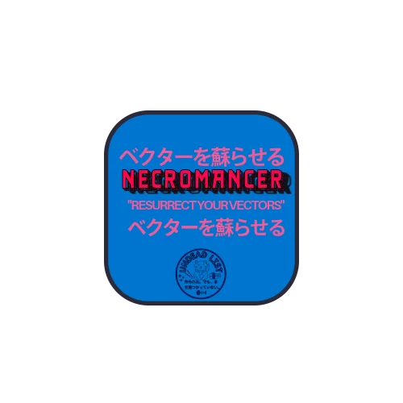

<p align="center">
  
</p>

<h1 align="center">SVG Necromancer</h1>

<p align="center">
  <strong>Resurrect your vectors</strong> | ベクターを蘇らせる
</p>

<p align="center">
  AI-powered SVG tool that generates, fixes, animates, and converts vector graphics.<br>
  Free forever. No account required. Your API key stays on your device.
</p>

<p align="center">
  <a href="#features">Features</a> •
  <a href="#why-use-this">Why Use This</a> •
  <a href="#quick-start">Quick Start</a> •
  <a href="#api-key">API Key</a> •
  <a href="#deployment">Deployment</a>
</p>

---

## Why Use This

**Problem:** Creating and editing SVGs is tedious. AI tools exist but require accounts, subscriptions, or send your data to servers.

**Solution:** SVG Necromancer runs entirely in your browser. Describe what you want, get an SVG. Paste broken markup, get it fixed. No signup, no tracking, no server—just you and Gemini AI.

| Use Case | Before | After |
|----------|--------|-------|
| Need an icon | Search stock sites, download, hope it fits | Describe it, get exactly what you need |
| Broken SVG from export | Manual XML debugging | Paste, click Fix, done |
| Static logo needs life | Learn CSS animations | Pick animation, apply instantly |
| React project needs component | Manual conversion | One-click React/Vue export |

---

## Features

| Tab | What It Does |
|-----|--------------|
| **Generate** | Describe any SVG in plain text → AI creates it |
| **View/Edit** | Live preview with syntax-highlighted code editor |
| **Fix** | Repairs malformed, broken, or incomplete SVGs |
| **Animate** | Adds CSS animations: pulse, spin, bounce, fade, draw, float, shake, glow |
| **Convert** | Exports to React component, Vue component, Base64, Data URI, or optimized SVG |

---

## Quick Start

**Option 1: Just open it**
```
Open src/index.html in any browser
```

**Option 2: Local server**
```bash
git clone https://github.com/undeadlist/Necromancer-.git
cd Necromancer-
npm run dev
# Open http://localhost:5000
```

No build step. No dependencies to install. It's one HTML file.

---

## API Key

SVG Necromancer uses **Google Gemini AI** (free tier, 15 requests/minute).

1. Get your free key: [Google AI Studio](https://aistudio.google.com/app/apikey)
2. Click the key icon in the app header
3. Paste your key

Your key is stored in your browser's localStorage. It never leaves your device. We don't have a server to send it to.

---

## Deployment

It's static HTML. Deploy anywhere:

| Platform | Setup |
|----------|-------|
| **Cloudflare Pages** | Connect repo, set output to `/src` |
| **Vercel** | Import repo, output directory: `src` |
| **Netlify** | Drag and drop `/src` folder |
| **GitHub Pages** | Enable Pages, select `/src` |
| **Self-hosted** | Copy `src/index.html` to any web server |

---

## Tech Stack

- Pure HTML/CSS/JavaScript (no framework)
- Zero npm dependencies
- Gemini 2.5 Flash API
- BYOK (Bring Your Own Key) model
- ~1900 lines, single file

---

## License

MIT — Use it however you want.

---

<p align="center">
  <strong>蘇生</strong><br>
  Built by <a href="https://undeadlist.com">UndeadList</a>
</p>
